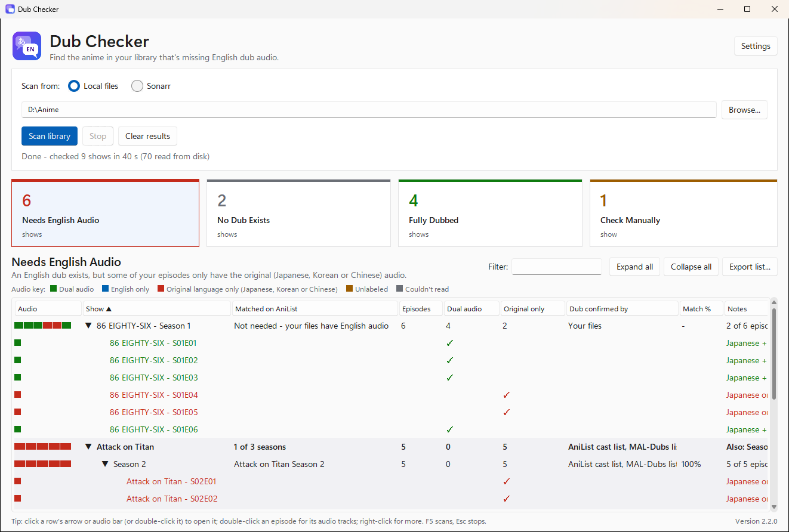
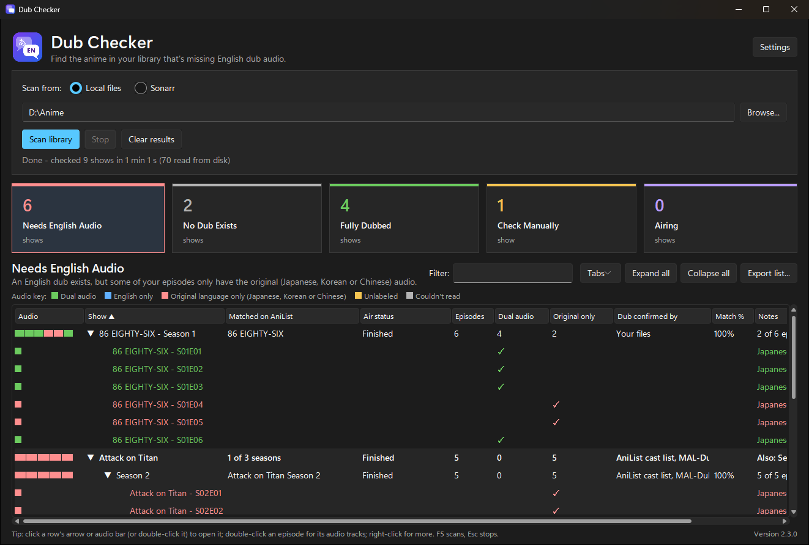
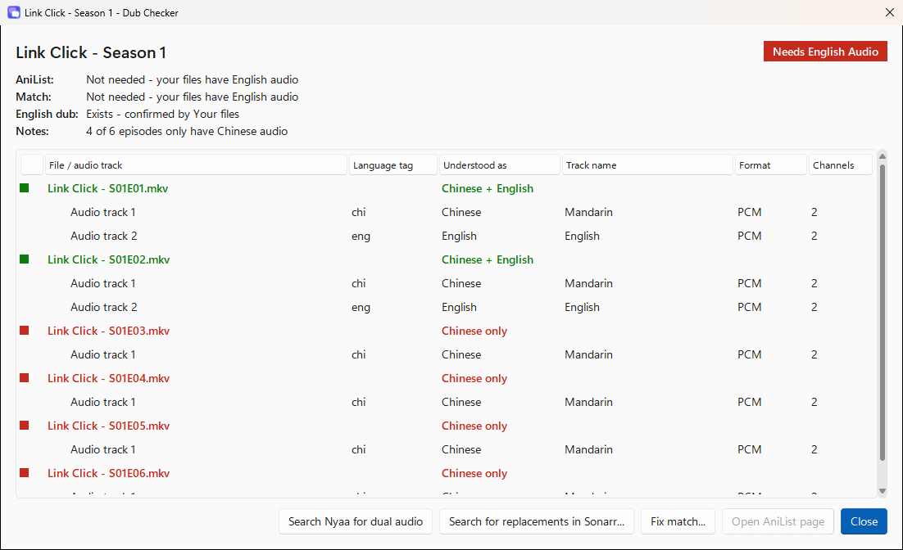
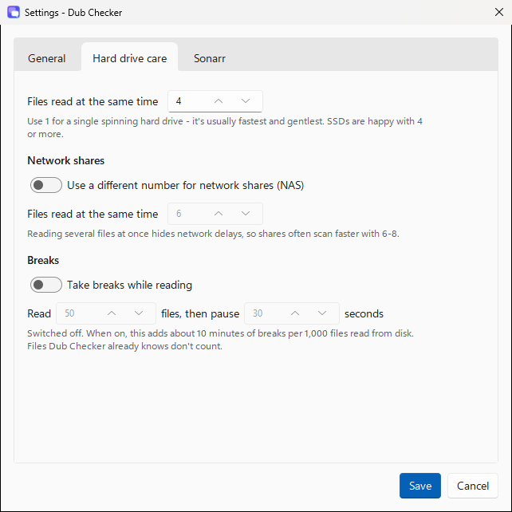

# Dub Checker

> [!IMPORTANT]
> **All of the code in this repository is 100% AI-generated.** It was written by an AI assistant from
> plain-English requirements, and has been tested but not written or line-by-line reviewed by a person.

Dub Checker scans your anime library (a folder, or a Sonarr server) and tells you
which shows are missing English dub audio, and whether an English dub exists at all.

**[Download the portable Windows app](../../releases/latest)**: unzip it and run `DubChecker.exe`. Nothing to install.



Each season lands in one of four groups:

| Group | Meaning |
|---|---|
| **Needs English Audio** | An English dub exists, but some of your episodes only have the original (Japanese, Korean or Chinese) audio. |
| **No Dub Exists** | No English dub was found, so there's nothing to replace yet. |
| **Fully Dubbed** | Every episode already has English audio. |
| **Check Manually** | Dub Checker couldn't be sure. The Notes column says why (no AniList match, a low-confidence match, audio without a language label, a file that couldn't be read, or the dub couldn't be checked). |

## Screenshots

| Dark mode | The episode window |
|---|---|
|  |  |

| Settings: hard drive care |
|---|
|  |

## Quick start

### Portable app (Windows, nothing to install)

1. Download the zip from the [latest release](../../releases/latest). Unzip it anywhere you can write to, such as Documents or a USB stick. Don't use Program Files.
2. Double-click `DubChecker.exe`.
3. If SmartScreen says "Windows protected your PC", click **More info**, then **Run anyway**. It appears because the exe isn't code-signed.

### From source (Windows, macOS, Linux)

You need Python 3.10 or newer with tkinter.

- **Windows:** double-click `run.bat`. It finds Python without relying on PATH. It checks the per-user installs, then Program Files, then the `py` launcher, then `python`. It prints which Python it used.
- **macOS / Linux:** run `sh run.sh`. It checks the python.org framework, Homebrew, `/usr/local/bin`, `/usr/bin`, then PATH.

Both launchers hand over to `bootstrap.py`, which:

- checks Python and tkinter, with an install hint for your system if something is missing;
- creates a private `.venv`;
- installs `requirements.txt`, and only again when that file changes;
- starts the app.

If you copy the folder to another PC or use a different Python, `.venv` is rebuilt automatically. `run.bat --setup-only` prepares everything without starting the app.

## Moving between PCs

Everything lives in the program folder. Settings and saved data are in `UserData/` next to the program. Nothing goes into AppData or the registry, so moving means copying the whole folder, `UserData` included.

If your anime folder is on the same drive as Dub Checker, its path is saved without the drive letter. On a USB stick that shows up as `E:` on one PC and `F:` on another, the library is still found. Network (UNC) paths are saved exactly as they are.

**Updating:** unzip the new version and copy your old `UserData` folder into it.

## Using the app

1. Choose **Scan from: Local files** and pick your library folder, or choose **Sonarr** (see below).
2. Click **Scan library** (or press **F5**). **Stop** (or **Esc**) keeps everything finished so far.

A scan runs in two phases:

1. **Reading audio tracks.** Every episode file is read first, for example "Reading audio tracks: file 132 of 840 (Show 12 of 60: Title)". Files that are already known and unchanged come from the cache instantly.
2. **Checking AniList only where needed.** Files are grouped into seasons.
   - A season with at least one dual-audio file (original language + English) has already proven a dub exists. It is decided from your files alone and appears in the table straight away, with "Dub confirmed by: Your files".
   - Every other season is looked up on AniList and appears as soon as its lookup finishes.
   - Each season is decided on its own, so Season 2 is never treated as dubbed just because Season 1 is.

**The results table**

- **The cards at the top are the tabs.** They count shows, not seasons.
  - Click a tab to select it and click it again to deselect it. Several can be selected at once, and their shows are listed together with a **Group** column saying where each season is. With none selected, every show is listed.
  - Tabs you don't use can be hidden: right-click one and choose **Hide this tab**, or untick it in the **Tabs** menu above the list. Hidden tabs stay hidden after a restart, and **Show all tabs** brings them back.
- **Airing tab and Air status column:** these show whether a show is still airing, not out yet, on hiatus, finished or cancelled, with the next episode's date while it airs (for example "Airing - ep 8 on 3 Oct"). The Airing tab lists shows that are still airing or not out yet, where an English dub may still be on its way. It cuts across the other groups. Click the **Air status** header to sort airing shows first.
- A show with several seasons is a bold row. **To open or close a show or a season**, you can:
  - click its ► arrow, or anywhere on its coloured audio bar;
  - double-click the row;
  - press Enter, Space or the Right/Left arrow keys.

  The row under the pointer is highlighted, and the pointer turns into a hand wherever a click will open something.
- **Every season drops down to its episodes**, listing each episode file. A ✓ under **Dual audio** or **Original only** shows which is which, the row is coloured to match, and Notes says e.g. "Japanese only", "Korean + English" or which track has no language. Opened seasons and shows are remembered after a restart.
- **The Audio column** is a coloured bar with one block per episode, in episode order, so you can see at a glance where the gaps are. The key above the table explains the colours:
  - green: dual audio (original language + English);
  - blue: English only;
  - red: original language only (Japanese, Korean or Chinese);
  - amber: unlabeled;
  - grey: couldn't be read.

  Click the **Audio** header to sort by the share of episodes still missing English.
- Click a column header to sort. Numbers sort largest first.
- Double-click an episode (or right-click a season and choose **Open episode window**) to see every audio track: the language tag, how Dub Checker understood it, the track name, format and channels. The window opens at the episode you clicked.
- Rest the pointer on a cell whose text is cut off (a long note, for example) to see all of it.
- Double-click the "Matched on AniList" cell to open the AniList page.
- Right-click for more options:
  - **Wrong show? Fix the match...** lets you paste the right AniList address, and only that season is checked again.
  - **Open file location** (after a Local files scan) opens the season's folder in Explorer with its first episode selected; on a show row it opens the show's folder. In the episode window, right-click a file to open its location.
  - **Search for replacements in Sonarr...** (when Sonarr is set up) asks Sonarr to look for new releases of the episodes that only have the original-language audio. On an episode row it searches for just that episode. See [Sonarr](#sonarr).
  - **Search Nyaa for "... dual audio"** opens [nyaa.si](https://nyaa.si/) in your web browser, searching the Anime category for the show's name plus "dual audio", most seeders first. If AniList knows the show by another name (such as its romaji title, which many releases use), that search is offered too. The episode window has the same search as a button. Dub Checker only opens the search page; it doesn't download anything.
- **Filter** (Ctrl+F) narrows the list; Esc clears it. **Export list...** saves what's listed as CSV (UTF-8, opens in Excel), one row per season, with each season's group and air status.
- **Your results are kept.** When you close Dub Checker and open it again, the last scan is back, with the same tab and open shows, and the status line says when it was made. A scan that was stopped, or still running when you closed the window, keeps the part that was finished.
- **Clear results** empties the table, resets the window and forgets the saved list, so it doesn't come back next time. Your settings, manual matches, and what Dub Checker knows about your files and AniList are kept, so the next scan is quick. To forget saved AniList answers, use **Settings > General > Clear saved online info**.

## Air status

Choose where air status comes from in **Settings > General > Air status**:

- **From AniList** (the default):
  - Shows that were looked up on AniList get it automatically.
  - Shows decided from your own files alone (a season with dual-audio episodes) normally skip AniList, so a last step called "Checking air status" looks them up too. Their group doesn't change, and seasons still missing English audio go first.
  - The first scan takes longer, because AniList asks apps to pace their requests. After that, finished shows are remembered for 30 days and still-airing shows are checked again twice a day.
- **From Sonarr:**
  - Dub Checker asks your Sonarr for each series' status and its calendar of upcoming episodes. That's two quick requests for the whole library, with no waiting on AniList.
  - Shows are matched to Sonarr by folder name (then title), so this also works after a local files scan, as long as Sonarr's address and API key are set.
  - A season with upcoming episodes is **Airing**, one whose first episode is still to come is **Not yet aired**, and one that's done is **Finished**. A show with no season information whose series continues with nothing scheduled is **On hiatus**.
  - Shows Sonarr doesn't have get no air status.
- **Off:** nothing extra is looked up, and the Air status column and Airing tab are hidden.

## Sonarr

Choose **Scan from: Sonarr**, then open **Sonarr settings...**:

- **Address:** e.g. `http://localhost:8989`. If you set a URL base in Sonarr, add it (`http://nas:8989/sonarr`).
- **API key:** find it in Sonarr under Settings > General.
  - **On Windows it's saved encrypted** in `UserData/config.json`, using Windows' own data protection (DPAPI), so only your Windows account on this PC can read it.
  - If you move the folder to another PC or Windows account, the app will ask you to enter the key again. The encrypted copy is kept, so it still works when you move back.
  - A plain-text key saved by an older version is encrypted automatically the first time you start this one.
  - On macOS and Linux it's saved as plain text, in a file only your user account can read.
- **Only series set to the Anime series type:** on by default.
- **Read files myself when Sonarr doesn't know a track's language:** on by default. Only files Sonarr couldn't label (or hasn't analysed) are read, through the same cache and throttle as folder scans.
- **Path mapping:** only needed if Sonarr runs on another machine or in Docker. For example, Sonarr sees `/tv` while this PC sees `\\nas\media\tv`. Fill in both or neither. If files can't be reached, you get one warning suggesting this.
- **Test connection** shows Sonarr's version, how many series it has, and how many are set to Anime.

**Searching for replacements.** Right-click a season or show (or use the button in the episode window) and choose **Search for replacements in Sonarr...**. Dub Checker finds the series in Sonarr by its folder name (or its title), matches your Japanese-only episodes to Sonarr's by file name, and starts an *EpisodeSearch* for exactly those episodes. If none can be matched (for example, the files were renamed since), it searches the whole season instead. This works after a Sonarr scan and after a Local files scan of a library Sonarr manages. Progress shows up on Sonarr's Activity page.

Sonarr only replaces a file when it finds a release it rates higher under your quality profile. To make it prefer dual-audio or English releases, give them a higher score with a custom format in Sonarr.

Works with Sonarr v3, v4 and v5 (API v3). Manual matches are shared between folder scans and Sonarr scans because both use the series folder name.

## Hard drive care and network shares

**Settings > Hard drive care**:

- **Files read at the same time:** default 4. Use **1** for a single spinning hard drive; it's usually fastest and gentlest.
- **Network shares:** optionally use a different number (default 6) when the library is on a NAS or SMB/NFS share. Reading several files at once hides network delays.
- **Take breaks while reading:** "read N files, then pause S seconds" (default 50 files / 30 s, off). The status line counts down, and Stop works during a break. Only real disk reads count; files already known skip the breaks.

Rescans are cheap even over SMB. Folder listings supply each file's size and date, so no per-file network requests are made. Only new or changed files are read, and MediaInfo reads just the file headers.

## Files and settings

Everything is in `UserData/` next to the program:

| File | What it holds |
|---|---|
| `config.json` | Settings (see below), including the Sonarr API key, encrypted on Windows. Rewritten on start so new settings appear; unknown keys are ignored. |
| `overrides.json` | Your manual AniList matches: season key → AniList ID. |
| `cache.db` | SQLite: audio tracks of every file read (keyed by path, size and date) and AniList answers. |
| `last_scan.json` | The results of your last scan, shown again when Dub Checker starts. Deleted by Clear results. |
| `dubInfo.json` | Saved copy of the [MAL-Dubs](https://github.com/MAL-Dubs/MAL-Dubs) list, refreshed weekly. |
| `logs/app.log` | Log files (rotated). Each scan logs a one-line summary. |
| `bin/` | `ffprobe`, downloaded only if MediaInfo can't be used. |

| Setting | Default | Meaning |
|---|---|---|
| `scan_source` | `folder` | `folder` or `sonarr` |
| `library_path` | | Your anime folder (saved without the drive letter when it's on the app's drive) |
| `theme` | `system` | `system` (match Windows), `light` or `dark` |
| `confidence_threshold` | 80 | AniList matches below this go to Check Manually |
| `cache_expiry_days` | 30 | How long AniList answers are reused |
| `anilist_min_interval` | 2.1 | Seconds between AniList requests (about 28 a minute) |
| `probe_workers` | 4 | Files read at the same time |
| `network_workers_enabled` / `network_workers` | off / 6 | A separate number for network shares |
| `pause_enabled` / `pause_every_files` / `pause_seconds` | off / 50 / 30 | Breaks while reading |
| `ignore_commentary_tracks` | on | Tracks named "Commentary" don't count |
| `air_status_source` | `anilist` | Where air status comes from: `anilist`, `sonarr` or `off` |
| `hidden_tabs` | none | The tabs you've hidden |
| `sonarr_url` / `sonarr_api_key_encrypted` | | Sonarr connection (the key is `sonarr_api_key` in plain text off Windows) |
| `sonarr_anime_only` / `sonarr_read_unknown` | on / on | Sonarr options |
| `sonarr_path_from` / `sonarr_path_to` | | Path mapping |

To reset, close the app and delete the files you want to start over with (or all of `UserData`).

## How dubs are detected

- **Languages:** a show's original language can be Japanese (anime), Korean or Chinese (donghua).
  - Recognised tags, including region suffixes like `ja-JP` or `zh-TW`:
    - Japanese: `jpn`/`ja`/`jp`/`japanese`;
    - Korean: `kor`/`ko`/`korean`;
    - Chinese: `chi`/`zho`/`zh`/`chinese`, plus `cmn` (Mandarin) and `yue` (Cantonese);
    - English: `eng`/`en`/`english`.
  - Untagged tracks fall back to a hint in the track name, such as "English", "Japanese"/"日本語", "Korean"/"한국어", "Mandarin", "Cantonese", "中文" or "國語". Conflicting hints stay unknown.
- **Files:** a file has dual audio as soon as it has an original-language track and an English one (for example Korean + English). A file is "Unlabeled audio" if any other track is unknown or there's no audio at all.
- **Dub signals:** a dub exists if any one of these says so:
  - English voice actors on AniList ("AniList cast list");
  - the MAL-Dubs community list;
  - English audio in your own files ("Your files").

  If none of them could be checked, the season goes to Check Manually.
- **AniList matching:** titles are fuzzy-matched against romaji, English, native titles and synonyms, adjusted for the year.
  - For Season 2 and later, Dub Checker follows AniList's sequel chain from Season 1 and also searches "Title Season N".
  - Specials always go to Check Manually.
  - Requests are rate-limited and every answer, including "not found", is cached.

## Development

```
dubchecker/
  main.py         start-up: logging, UserData check, DPI/taskbar setup, Tk main loop, clean shutdown
  config.py       Config dataclass, Overrides (manual matches), drive-letter-free path helpers
  models.py       data types: AudioTrack, FileResult, ShowGroup, AniListMatch, DubInfo, ShowResult, enums
  scanner.py      folder listing (scandir), title cleaning, season detection and grouping, network detection
  media_probe.py  MediaInfo / ffprobe readers, ffprobe download, language classification
  cache.py        SQLite cache (WAL, batched lookups and saves)
  anilist.py      GraphQL client with rate limiting, fuzzy matching, season logic
  dub_sources.py  MAL-Dubs list, combining dub signals, the online lookup service
  categorize.py   deciding the group and writing the notes
  sonarr.py       Sonarr API client, media info parsing, path mapping
  pipeline.py     the two-phase scan, the read throttle, scan statistics
  theme.py        sv-ttk light/dark, palettes, Card.* styles, DPI font scaling, title bar
  gui.py          main window
  dialogs.py      episode details, Fix match, Settings
  results_store.py  saving and loading the last scan's results (last_scan.json)
  ui_common.py    labels, colours, the results model, helpers
packaging/
  build.py        PyInstaller build -> dist/Dub Checker/ and dist/Dub Checker.zip
  make_icon.py    regenerates dubchecker/assets/icon.ico and PNGs (needs Pillow)
  entry.py        exe entry point
  README.txt      end-user readme copied next to the exe
tests/            unittest suite (see below)
```

**Running the tests** (from the project folder, after `run.bat --setup-only` or `sh run.sh --setup-only`):

```
.venv\Scripts\python -m unittest          (Windows)
.venv/bin/python3 -m unittest             (macOS / Linux)
```

The tests use synthetic MKV files (written by a tiny EBML writer in `tests/mkv.py`), a mock Sonarr server built on `http.server`, and fake readers and AniList clients. They cover:

- the two-phase order;
- the zero-read, zero-`os.stat` cached rescan;
- the read throttle;
- Stop;
- Clear results;
- results surviving a restart;
- the Sonarr replacement search.

The MediaInfo and ffprobe tests are skipped when those tools aren't available. ffprobe is looked for in `UserData/bin` and on PATH.

**Building the portable exe (Windows):** run `build.bat`.

- It prepares `.venv`, installs PyInstaller into it, and builds a windowed one-folder app. The build bundles MediaInfo.dll, the sv-ttk theme and the icon, and sets the version shown in Explorer.
- It writes `dist/Dub Checker/`, keeping any `UserData` already there, and `dist/Dub Checker.zip`, which never contains `UserData`.
- If `DubChecker.exe` is running from `dist`, the build stops and asks you to close it.

**Regenerating the icon:** `pip install pillow`, then `python packaging/make_icon.py`.

## License

[MIT](LICENSE). You're free to use, copy, modify, merge, publish, distribute, sublicense and sell copies of Dub Checker, for any purpose. Keep the copyright and license notice with it. It comes with no warranty.
